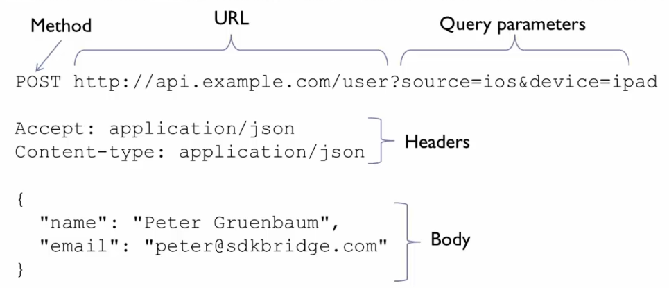
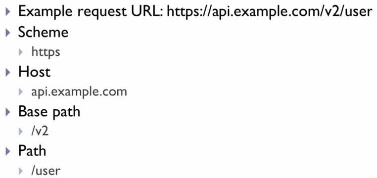
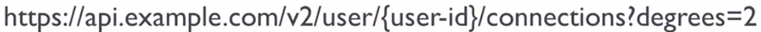
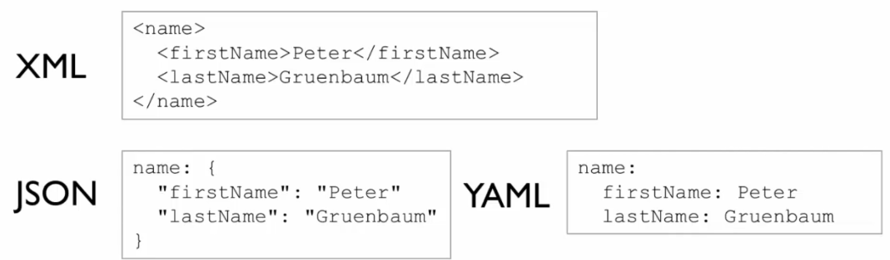
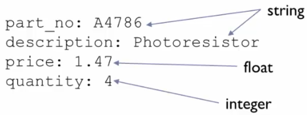
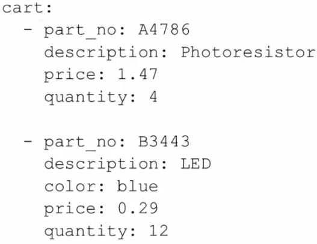
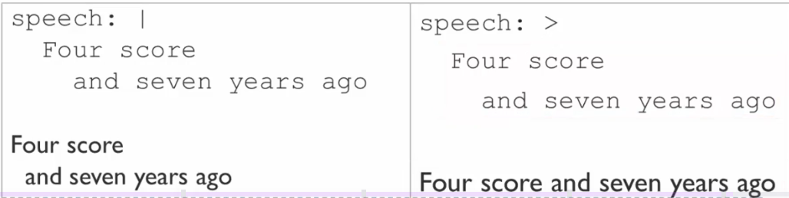
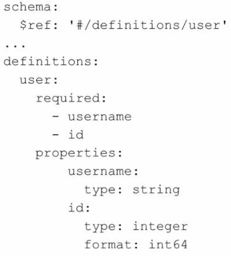

# Section 1 Introduction

Swagger and the Open APO Specification are used to define REST (Representational State Transfer) APIs, which are a type of web API.

## Lesson 1 Intro
An <u>A</u>pplication <u>P</u>rogramming <u>I</u>nterface defines how software talks to each other using requests for data and responses returning data.


An API definition file includes:

* Description of everything you can do with the API 
* List of each request that is available
* Description of how to make each request
* List of the response for each request

Why create an API definition?

* Lets you design the API before implementing it
* Helps with automated testing
* Can automatically create code in several languages
* Can automatically generate documentation
    * Doc can be interactive; you can make API calls from within the doc

### Swagger
Initially Swagger was a specification for how to create an API definition file. After Swagger 2.0, the specification became the Open API Specification (OAS). Swagger is now a collection of tools that use the OAS. Many people still refer to OAS as Swagger.

Swagger tools:

* Swagger Editor: Use to write OAS files
* Swagger CodeGen: Generates code in popular languages for using the API
* Swagger UI: Generates doc from the OAS files
* SwggaerHub: Hosted platform for designing and documenting APIs

### Open API Initiative (OAI)
An organization created by a consortium of industry experts that focuses on creating, evolving, and promoting a vendor-neutral description format. OAI is in charge of OAS but not any of the tools that use it.

## Lesson 2 API Definition

API Definition File is a file that describes everything you can do with an API.
 > [!NOTE]
 > In this course, API refers to a collection of related http requests. Sometimes people refer to an individual request as an API.

The file includes:

* Server location that hosts the API 
* Security/authorization info
* All available requests in the API
* All of the different data you can send in the API
* What data is returned
* What http status codes can be returned, i.e., 200 OK, error codes, etc.

### Anatomy of a Request

The request consist of five parts:



1. Method: Verb that indicates what action to take such as GET, POST, PUT, DELETE, etc.
2. URL: Describes where the action will occur
3. Path and Query parameters: Refines the action in some way
4. Headers: Stores info about the request
5. Body: Contains additional data

#### URL



The host and base path are the same for all requests within the API, but the path varies depending on the request. This is the end point?

#### Parameters

In this example, you are requesting the connections of a specific user
within two degrees.



The URL contains two parameters:

* Path parameter: _{user-id}_
* Query parameter: _degrees=2_

#### Request Body
For some methods, such as POST and PUT, you can specify a request body. It is often in JSON, and you specify a schema for the request body that defines what the JSON will look like. The body is treated like a path parameter.

### Response Body

* In REST, the response body is most often structured data such as JSON but it can be anything.
* The response body is included in the response object.
* The response object has a schema to describe the structured data.
You can have a separate response object for each HTTP status code that is returned. So one schema for 200 and another for 404, and so on.

### Security
Security includes authentication and authorization.

* Authentication is ensuring that the user has a valid username and password. 
* Authorization is ensuring that the user has permission to access the data that they are requesting.

Security in the OAS can be:

* None
* Basic Auth: Sending the username and pw with each request
* API key
* OAuth

### Documentation
The API definition files can contain human-readable descriptions of elements, like parameters and bodies. The descriptions can be used to generate doc automatically.

Add a description section for:

* API
* Each operation (path and method)
* Each parameter
* Each response element

You can get info for an OAS file from:

* Developers
    * Most commonly they will provide sample requests and responses 
    * They might also provide rough doc
* Code, if you have strong coding skills

## Lesson 3 YAML
 
[YAML](https://yaml.org/) is a structured data format used in the OAS format. You can also use JSON.

YAML is used for data, not content. It relies on indentation and minimizes character usage. It is used primarily for config files and in apps where data is stored or transmitted, not files passed over the web.

### Key/Value pairs
Key/values pairs are indicated by a colon followed by a space.
```
date: 2025-03-08
firstName: Mathias
```
### Levels
Levels are indicated by white space indenting. You cannot use the tab key. In this example, note how many characters XML and JSON use compared to YAML. The indentations for XML and JSON are not needed, just used to make it easier to read. The indentations are required for YAML levels.



### Parameter Types
Types are determined by context in YAML.



Quotes are not required except to indicate that a value that would normally be interpreted as a number or boolean is instead a string. You can use single or double quotes.

```
price: 11.47 (float)
version: '11.47' (string)
```

### Lists
Use a dash for the first key/value pair to indicate a list. You don't need to declare the list.



### Multi-line strings

You must use other characters on multi-line strings since you don't use quotation marks.

* | => preserves lines and spaces
* \> => folds lines
* There are other variations such as _|-_ or _|+_. Refer to a cheat sheet.



### Comments
Comments are denoted with #. Everything after the # is ignored.

```
# LED
part_no: B3433
description: LED
color: blue
price: 0.29 # USD
quantity: 12
```
### Schemas
Althought not officially part of YAML, OAS uses reference for schemas in request and response bodies. Use _$ref_ to indicate a reference (path) which refers to the schema that is explained in another part of the doc, the definitions section.




