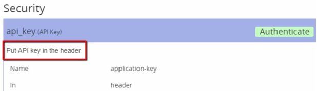

# Section 2 Open API Specification

## Lesson 4 Note about OAS 3 and the Swagger Editor

This course describes OAS 2. A newer version, OAS 3, is now available.

This article describes the differences between the two: https://blog.restcase.com/6-most-significant-changes-in-oas-3-0/.

In the following video, the Swagger editor URL is listed as https://editor2.swagger.io/, but it is now https://editor.swagger.io/

## Lesson 5 Open API Specification Basics

For an example on how to build the file, we're using a company/service where you can upload and share photos.

The company is example.com.

The API base URL is https://api.example.com/photo.

### Starting a file
Every API definition file starts with the info below.


### Request with query parameters

Adding a request to get photo albums. The request requires:

* URL endpoint
* HTTP Method
* Path parameters
* Query parameters
* Request body
* Responses

GET https://api.example.com/photo/album?start=2017-09-01&end=2017-09-31

The API definition file:


* Under the _paths_ key, list all of the possible URL end points for the URL (such as albums). Under each end point, list all of the operations (GET, etc.) that are used. 
* The _required: false_ key/value pair is only needed if the parameter is optional.

### Request with path parameter

GET https://api.example.com/photo/album/123456


The _required:_ key is almost always _true_ for path parameters.

### Data types
These values are valid types:

* boolean: true/false, yes/no
* integer: whole number
* number: whole or decimal number
* string: text
* array: list of items

### Custom headers

Custom headers in requests are treated as parameters. Standard headers (auth, content format) are handles elsewhere.


### Swagger Editor

Swagger provides an editor for Open API Specification files. The YAML file is displayed on the left and a preview of the doc is on the right. If you edit the file incorrectly, an error will pop up on the right.

https://editor.swagger.io/

## Lesson 6 Schemas

Certain kinds of request (POST, PUT, etc.) have extra data called the request body. Typically the data is formatted in JSON, sometimes XML, but can be anything like an image, video, or sound file.

Nearly all responses return a response body. Again typically in JSON but can be anything.

Schemas indicate the structure of the data in request and response bodies. There can be many levels in a schema. OAS schema object is based on the [JSON schema specification](http://json-schema.org/).

The main things that the schema define are:

* The keys in the key/value pairs
* The types of data for the values

### $ref

_$ref_ is a special OAS key that indicates the value is a reference to a structure somewhere else in the YAML file. Helps to avoid too many indentation levels.

_schema_ would replace _type_ in parameters because the extra data contains multiple types. 


Under parameters add this info:

* _name_: Just for reference; not shown in docs
* _in_: Set to body
* _required_: Typically set to true
* _schema_: _$ref_: Value of the reference path, in quotes 


### Schema section

To create a schema section:
1. Create a _definitions_ key at the end of the file.
2. Indent a level and then specify the name from the _$ref_ value (newAlbum).
3. Indent a level, and add a _properties_ key.
4. Indent a level, and add a key for each top level element in the JSON (name, date, etc.).
5. For each of the element keys, indent a level and specify the _type_ of data (integer, string, etc.).

```
definitions:
  newAlbum:
    properties:
      name:
        type: string
      date:
        type: string
```          
### Schema objects
You can add other objects as values by using _type: object_, add a _properties_ level and then continue as before.

```
author:
  type: object
  properties:
    firstName:
      type: string
    lastName:
      type: string
```  
You can use _$ref_ in definitions and then define the schema in the definitions section. Use the below instead of the code above.

```
author:
  $ref: '#/definitions/person'
```
```
person:
  properties:
    firstName:
      type: string
    lastName:
      type: string
```  

### Arrays

For simple arrays (lists), such as the _relatedAlbumIds_ array below:

```
relatedAlbumIds: 
  type: array
  items:
    type: string
```
For complex arrays, use _$ref_.


### Required elements in a schema

In requests, you can indicate that certain elements are required or optional. Use the _required_ key with a list to indicate which values are required.

```
photo:
  properties:
    id:
      type: integer 
    name:
      type: string
    longitude:
      type: number
    latitude:
      type: number
  required:
    - id
      name
```

### Response Body schema

You can have different schemas for different response codes. 


### allOf key

Use the _allOf_ key to combine similar object. For example, the _album_ and _newAlbum_ objects are the same except that _album_ has the added property of _id_.

This is the newAlbum definition:

```
definitions:
  newAlbum:
    properties:
      name:
        type: string
      date:
        type: string
```         
This is the _album_ definition using _allOf_:

```
album:
  allOf:
    - $ref: '#/definitions/newAlbum'
    - type: object
      properties:
      id:
        type: integer      
```         
### Features that are not commonly used
Refer to these features in the Open API Specification doc if you need to use them:

* Custom headers in responses
* Example bodies in OAS files
* Form data used in brequest body instead of JSON where each parameter is a property

```
parameters:
  - name: firstFileName
    in: formData
    required: true
    type: string
```    
## Lesson 7 Open API Specification: Security, Error Conditions, Content Types, and Operation IDs

### Security
What type of authentication (username and pw) or authorization (allowed access to API and data) is required.

#### Four security types

1. None: Usually for getting publically available info; don't need include any security info to the file.
2. API key: Indicates that the app has permission to use the API.
3. Basic Authentication: Username and pw in the header everytime the API is used but unless using HTTPS, not secure.
4. OAuth: Complex issuance of temporary token using username and pw. Expires quickly. See [OAuth info online](https://swagger.io/docs/specification/v3_0/authentication/oauth2/).

> [!Note]
> OAuth is complicated and is not fully explained in this course.

#### How security is indicated for each API

* Security key for each operation
  
  * Contains an array of security definition objects
  * Usually only one element in the array

* Security definitions 

  * Uses a _securityDefinitions_ key that contains secuity objects
  * Typically at the end of the file

* Security object

  * Contains info needed for that type of security

#### API key
1. Add a security key to each operation

   * Use a dash to indicate an array
   * Create a name for the definition and use an empty bracket [] to indicate an empyty array since no data is needed.
2. Add security definition
  * Add a definition for that name in the _securityDefinition_ section

    * _type: apiKey_

    * _name:_ name of the header or query parameter to be used

    * _in:_ _query_ or _header_

  > [! Note]  
  > * _api_key_ is made up, could be anything. As long as it matches the infor in the _securityDefinitions_ section. 

  This info would go in an operation sections, such as _get_.

  ```
  security:
    - api_key: []
  ```
  The securityDefinitions info goes at the end of the file. If the apiKey is in the header, use the code below. The _name_ is the name of the header, the value of which will be the apiKey.

  ```
  securityDefinitions:
    api_key:
      type:apiKey
      name: application-key
      in: header
  ```

If the apiKey is in a query such as https://...?token=23a645ga2798, use this code:

```
  securityDefinitions:
    api_key:
      type:apiKey
      name: token
      in: query
```

#### Basic authentication
1. Add a security key to an operation.

   * Use a dash to indicate an array
   * Create a name for the definition and use an empty bracket [] to indicate an empyty array since no data is needed.
2. Add security definition.

   * Add a definition for the name in the securityDefinition section with  _type: basic_.

```
security:
  - basic_auth: []
```
```
securityDefinitions:
  basic_auth:
    type: basic      
```

After you add the above code in Swagger, an Authorize button is diplayed. Click it to enter a username and pw. You must provide that info before you can try the operation.

#### OAuth


1. Add security key to request but you add scopes in the array. Different operations might require different scopes.
2. Add the security definition to include:

   * _type: oauth2_
   * One of these values:
      * _authorizationURL_: URL where credentials are entered
      * _tokenURL_: URL for token
   * _flow_: OAuth2 flow such as implicit, password, application, or accessCode
   * _scopes_: list of scopes with definitions

Security key in the operation section. The scope, write:albums, means that the use has to have the authorization to create, modify, and delete albums in order to make the request

```
security:
  - oauth_example:
    - write:albums
```
Below the authorization URL points to a dialog which allows the user to login/provide credentials.

```
securityDefinitions:
  oauth_example:
    type: oauth2
    authorization: http://example.com/authenticate
    flow: implicit
    scopes:
      write:albums: modify albums in your account
      read:albums: read albums in your account      
```
### Error Conditions

Error are simply different response codes. Error responses often return info with a special structure. For example 401 (Unauthorized) may return this JSON message which indicates why the user is unauthorized:

```
{
  "errorCode": 13
  "message": "Username not found"
}
```
You should include every potential status code for an operation in the response section and a related schema in the definitions section.

```
responses:
  # Response code
  200:
    description: successful response
    schema:
      $ref: '#/definitions/playlistWithSongs'
  401:
    description: unauthorized
    schema:
      $ref: '#/definitions/error'
```
```
definitions
# Error info
error:
  properties:
    code:
      type: integer
    message:
      type: string  
```
### Content Types

Content types indicate the format of the data in the request and response bodies. Use the _Content_Type_ header to specify the value such as _application/json_. You can specify the content type for the entire API or individual operations. Use the _consumes_ key for requests and _produces_ key for responses.

Other examples of content types [(MIME type?)](https://developer.mozilla.org/en-US/docs/Web/HTTP/MIME_types/Common_types), which are comprised of type and subtype, are _text/plaintext_, _image/jpeg_, _image/png_, etc.

To indicate JSON for the entire API:

```
# URL data
host: api.muzicplayz.com
basePath: /v3
schemes:
  - https
consumes:
  - application/json
produces:
  - application/json
```
To indicate JSOn for an operation:
```
get: 
  parameters:
    - name: playlist-id
      in: path
      required: true
      type: string 
  consumes:
    - application/json
  produces:
    - application/json    
  #Responses
  responses:
    # Response code
    200:
      description: successful response
      schema:
        $ref: '#/definitions/playlistWithSongs'
```
### Operation IDs

You can add an operation ID to each request. It isn't included in the documentation but some tools, such as automated testing tools, might use the IDs.

```
get: 
  operationId: getAlbums
  parameters:
    - name: playlist-id
      in: path
      required: true
      type: string  
```

## Lesson 8 Documentation

### Autogenerated documentation

Tools, including Swagger, takes OAS files and genereates HTML documentation. If the OAS file is up to date, the autogen doc is likely to be more accurate than docs written manually. Autogen doc is beneficial because it allows you to generate requests from within the doc. Allows developers to fully understand the API before implementing them in code.

See the [Swagger Petstore](https://petstore.swagger.io/) as an example.

#### description key
Use the description key to add documentation the elements listed below. The descriptions will display in the doc on the right side:

* API info
  
  ```
  info:
    version: '0.0.1"
    title: Example Photo service
    description: Photo API with Albums
  ```
  

* Operations
  
  ```
  paths:
    /album:
      get:
        operationId: getAlbums
        description: Get one or more albums.
  ```
* Parameters

  ```
  parameters:
    - name: start
      in: query
      required: false
      type: string
      description: Starting date. Format YYY-MM-DD HH:SS
    - name: end
      in: query
      required: false
      type: string
      description: Ending date. Format YYY-MM-DD HH:SS  
  ```
* Responses

  ```
  responses:
    200:
      description: Successful response
      schema:
        $ref: '#/definitions/error'
  ```
  

* Schema definitions

  
  
  
  
  ```
  securityDefinitions:
    api_key::
      type: apiKey
      name: application-key
      in: header
      description: Put the API key in the header.
  ```
  

You can use Markdown in the description key.


    


