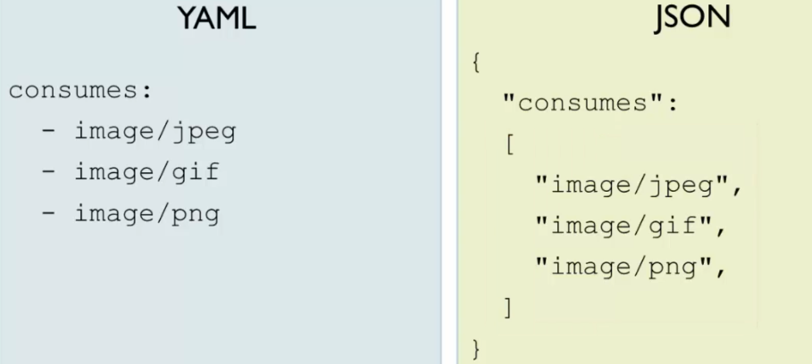

# Section 3 Tools and Alternatives

Go to Swagger @ https://swagger.io/.

## Lesson 9 Swagger Tools

Swagger Editor, CodeGen, and UI are open source. Swagger Hub is not open source but a free trial is available and you don't have to download any software.

See Exercise 6: SwaggerHub.

## Lesson 10 JSON

You can create OAS files using JSON. You might do so if the people you are working with are more familiar with JSON than YAML. Also, some tools only read JSON.

You can use JSON with Swagger, but YAML is the default format of Swagger. It is seemingly better because it uses fewer characters and is easier to read.

### Differences

* JSON uses quotes around strings, even key names, whereas YAML only uses qutoes when a string may be construed as a number ("2164").
* JSON uses curley brackets {} instead of YAML indentations. (Indent brackets to improve JSON readability.)

* JSON uses arrays instead of YAML lists.

## Lesson 11 Alternatives to Swagger and OAS

Some feel that Swagger could be more responsive, prettier, etc. Other options include DapperDox, ReadMe.io, StopLight.io, and Swagger UI variants.

OAS is just one way to define an API. Other options inclue RAML and API Blueprint (Apiary).
